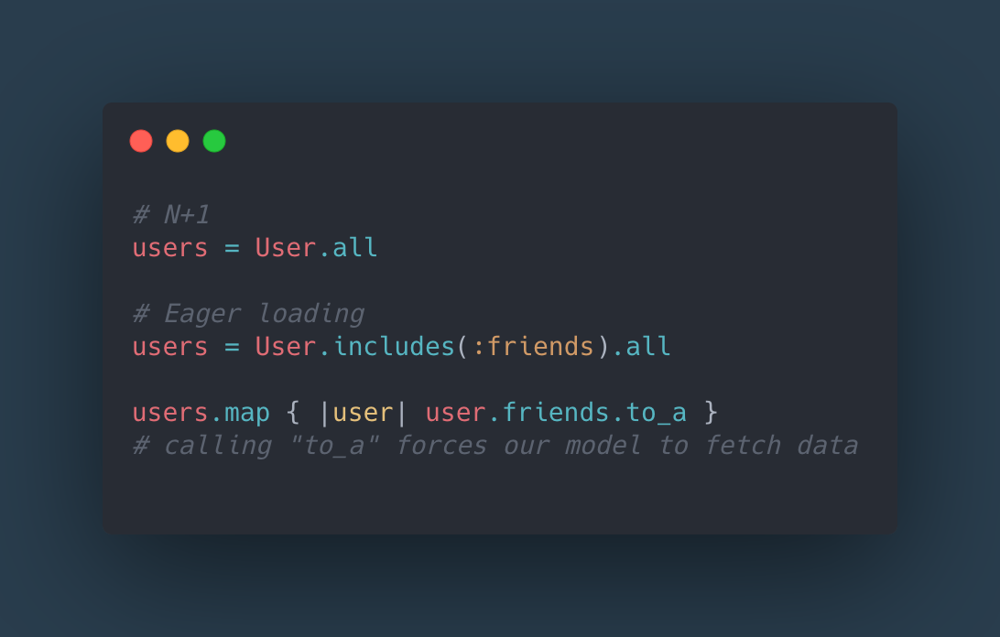

# N+1 Query

What is an N+1 query? Consider a situation where you have users that each have many friends. If we loop to map the friends, we could write the following map code.

With this first solution every time you access a user’s friends, it goes back to the database to load them, generating an N+1 query.

The ActiveRecord solution is to eagerly load the data and this is accomplished with a simple method includes.

