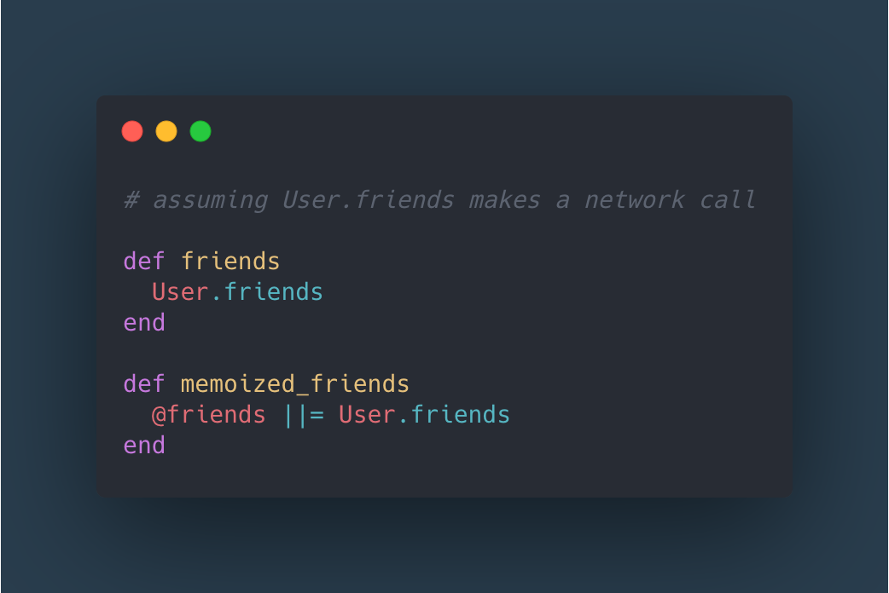

# Ruby Memoization

Memoization is a technique you can use to cache the result of a method that do time-consuming work and can be executed once.

That means that you’ll only make the network call the first time you call memoized_friends, and future calls will just return the value of the instance variable @friends.

